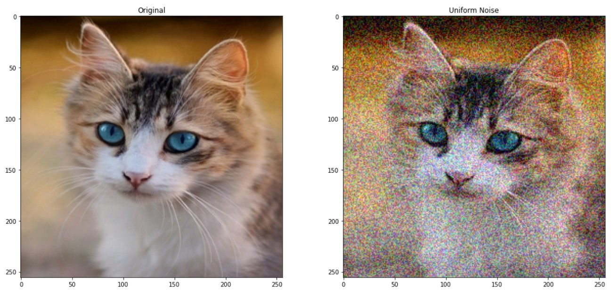
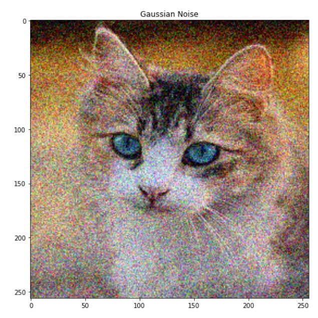
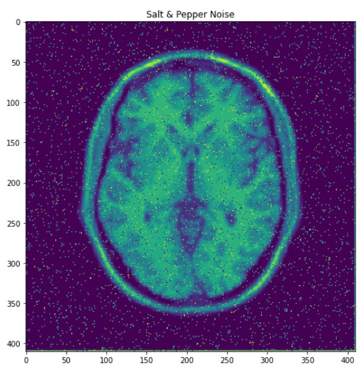
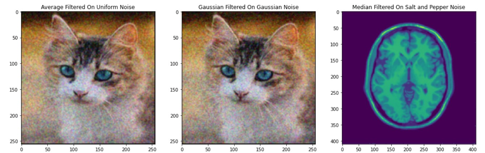
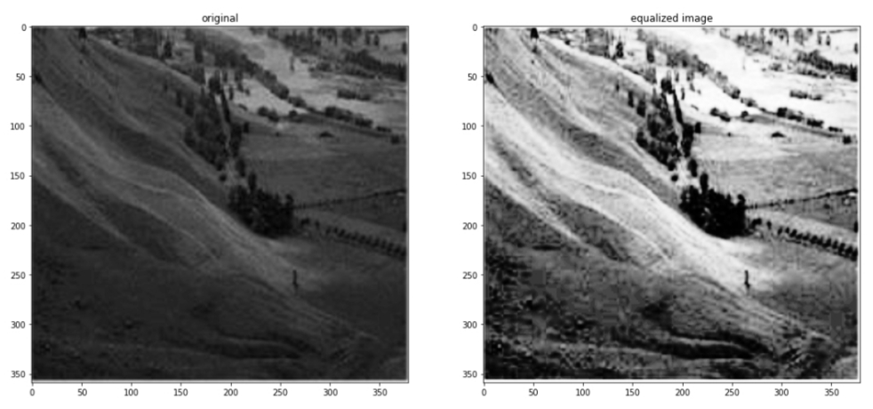
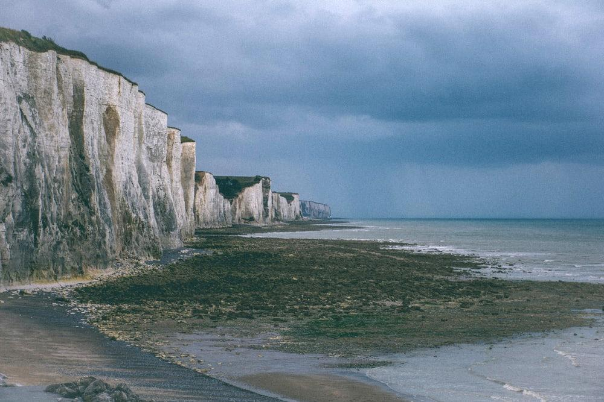

# task 1

## **Team 6**

**Team Members:-**

| Name                     | Sec |  BN |
| :----------------------- | :-: | --: |
| Alaa Seif elnasr Ibrahim |  1  |  11 |
| Ahmed mohamed farouk     |  1  |   6 |
| Habiba Mahmoud           |  1  |  25 |
| Hasan Hosni              |  1  |  26 |
| Mariam Galal Mohamad     |  2  |  25 |

**NOTE:** Run main.py from root directory of th repo

# Noise:

## Uniform Noise:

## Gaussian Noise:

## Salt and pepper Noise:

# Filters:

# Histogram equalization

It is applied to a gray scale image ,by using the histogram of the image
to enhance the image contrast.

# Normalization

### - We applied linear normalization (contrast stretching) by changing scale of pixels intensities to cover all range from 0 to 255

- For image that is shown below intentisties range from 6 to 200
  

- After applying normalization, intentisties range becomes from 0 to 255
  

### - The differnce between two image is clear to bring the image into a range that is more normal to the senses
